# 핏루틴 (FitRoutine)

관심사·가능 시간·현재 레벨 세 가지만 입력하면 AI가 이번 주 운동/취미 루틴을 만들어주는 웹 서비스입니다.

- 배포 URL: [https://fitroutine-steel.vercel.app](https://fitroutine-steel.vercel.app)

## 검증 체크리스트

- [x] 배포 URL 접속 시 메인 페이지 정상 표시
- [x] 상단 네비게이션으로 메인/AI추천/FAQ 3개 페이지 이동 확인
- [x] 모바일 화면(360px대)에서 레이아웃 깨짐 없음
- [x] AI 추천 폼에 입력 → 결과가 화면에 표시됨
- [x] 빈 입력 상태로 제출 시 안내 메시지 표시
- [x] FAQ 문의하기 폼 제출 → 이메일 알림 수신 확인
- [x] 다크모드 토글 정상 동작 (텍스트 가독성 포함)
- [x] Vercel Web Analytics에 방문 데이터 수집 확인

## 서비스 소개

운동이나 새로운 취미를 시작하고 싶지만 무엇부터 해야 할지 막막한 사람들을 위한 서비스입니다.
간단한 정보 입력만으로 AI가 초보자도 무리 없이 따라할 수 있는 7일 루틴을 "티켓" 형태로 제안합니다.

## 페이지 구성

| 페이지 | 파일 | 설명 |
|---|---|---|
| 메인 | `index.html` | 서비스 소개, AI 추천 페이지로 이동하는 CTA |
| AI 추천 | `recommend.html` | 관심사/시간/레벨 입력 → AI 루틴 결과 표시 |
| FAQ | `faq.html` | 자주 묻는 질문 |

## 기술 스택

- **프론트엔드**: HTML5, CSS3, Vanilla JavaScript (프레임워크 미사용)
- **백엔드**: Vercel Serverless Functions (Python, Flask/WSGI)
- **AI API**: [Groq API](https://console.groq.com/) (`openai/gpt-oss-20b` 모델, 무료 티어)
- **배포**: Vercel

**프론트/백엔드를 분리한 이유**: 프론트엔드(정적 파일)와 백엔드(API 키가 필요한 로직)를 분리하면, API 키 같은 민감 정보가 브라우저에 노출되지 않고 서버 환경에서만 사용됩니다. 또한 정적 파일은 CDN에서 즉시 서빙되어 빠르고, API 함수만 필요할 때 개별적으로 실행(서버리스)되어 비용과 유지보수 부담이 줄어듭니다.

### 페이지 구성 요소별 담당 범위

| UI 요소 | HTML | CSS | JavaScript |
|---|---|---|---|
| 네비게이션 바 | 메뉴 구조 마크업 | 데스크톱/모바일 레이아웃, 다크모드 색상 | 햄버거 메뉴 토글(`nav.js`), 테마 전환(`theme.js`) |
| AI 추천 폼 | 입력 필드 마크업 | 폼 스타일, 반응형 배치 | 입력 검증, `fetch` 요청, 로딩/결과/오류 상태 전환(`recommend.js`) |
| 루틴 결과 티켓 | 결과 컨테이너 마크업 | 티켓 카드 디자인 | AI 응답 텍스트를 DOM에 삽입 |
| 문의하기 폼 | 입력 필드 마크업 | 폼 스타일 | Formspree 전송, 성공/실패 메시지 처리(`contact.js`) |

## 프로젝트 구조

```
fitroutine/
├── index.html          # 메인 페이지
├── recommend.html       # AI 추천 페이지
├── faq.html              # FAQ 페이지
├── css/
│   └── style.css         # 전체 스타일 (반응형 포함)
├── js/
│   ├── nav.js             # 모바일 메뉴 토글
│   └── recommend.js       # 폼 처리, fetch, 에러/로딩 처리
├── api/
│   └── recommend.py       # AI API 연동 서버리스 함수
├── requirements.txt       # Python 의존성 (표준 라이브러리만 사용)
├── .env.example            # 환경 변수 예시
└── README.md
```

## 로컬 실행 방법

이 프로젝트는 순수 정적 파일 + Vercel 서버리스 함수로 구성되어 있어, 로컬에서 전체 기능(AI 호출 포함)을 테스트하려면 Vercel CLI를 사용하는 것이 가장 간단합니다.

```bash
# 1. Vercel CLI 설치
npm install -g vercel

# 2. 프로젝트 폴더에서 로컬 개발 서버 실행
vercel dev
```

실행 후 안내되는 로컬 주소(예: `http://localhost:3000`)로 접속하면 프론트엔드와 `api/recommend.py`가 함께 동작합니다.

> 정적 화면만 빠르게 보고 싶다면 `index.html`을 브라우저로 바로 열어도 되지만, 이 경우 AI 추천 기능(`/api/recommend` 호출)은 동작하지 않습니다.

## 환경 변수 설정 방법

이 프로젝트는 Groq API 키를 환경 변수로 관리합니다. **코드에 키를 직접 적지 마세요.**

1. [Groq Console](https://console.groq.com/keys)에서 무료 API 키를 발급받습니다.
2. **로컬 개발 시**: 프로젝트 루트에 `.env` 파일을 만들고 아래처럼 작성합니다. (`.gitignore`에 포함되어 있어 커밋되지 않습니다.)
   ```
   GROQ_API_KEY=발급받은_키
   ```
3. **Vercel 배포 시**: Vercel 프로젝트 대시보드 → `Settings` → `Environment Variables`에서 `GROQ_API_KEY` 값을 등록합니다. 등록 후에는 재배포가 필요합니다.

### 키가 실수로 노출됐을 때 대응 절차

1. **Groq 콘솔에서 즉시 폐기**: [console.groq.com/keys](https://console.groq.com/keys) 접속 → 노출된 키의 휴지통 아이콘 클릭 → 삭제(revoke)
2. **새 키 발급**: 같은 페이지에서 Create API Key로 재발급
3. **환경 변수 갱신**: Vercel 대시보드의 `GROQ_API_KEY` 값을 새 키로 교체하고 재배포
4. **Git 이력 정리**: 만약 이미 커밋에 키가 포함됐다면 `git rm --cached <파일>`로 추적을 해제하고, 필요 시 `git commit --amend`로 직전 커밋에서 제거한 뒤 push (이미 원격 저장소에 올라갔다면 `git filter-repo` 등으로 이력 전체에서 제거 필요)

이번 프로젝트에서도 `.env.local`에 키가 포함된 채 커밋될 뻔했는데, GitHub의 Push Protection이 감지해 push 자체가 차단되어 실제로는 원격 저장소에 올라가지 않았습니다. (자세한 경위는 아래 "개발 과정에서 겪은 시행착오" 참고)

## API 명세

`POST /api/recommend`

**요청 예시**
```json
{
  "interest": "러닝",
  "time": "20~40분",
  "level": "초급"
}
```

**성공 응답 (200)**
```json
{
  "routine": "월: 가벼운 러닝 20분\n화: 휴식: 스트레칭 5분\n...\n팁: 매일 같은 시간에 시작하면 습관이 되기 쉽습니다."
}
```

**오류 응답 예시**
```json
// 필수값 누락 (400)
{ "error": "관심사와 가능 시간은 필수입니다." }

// AI API 오류 (502)
{ "error": "AI API 오류가 발생했습니다 (429).", "detail": "..." }
```

**프롬프트 설계 의도**: 프롬프트에 "요일: 활동 내용" 형식을 명시적으로 지정해 파싱 없이도 결과를 바로 화면에 표시할 수 있게 했습니다. `temperature`는 0.7로 설정해 매번 비슷하지만 약간씩 다른 루틴이 나오도록 했고, `max_tokens`는 500으로 제한해 7일치 루틴 + 팁 한 줄 분량에 맞추면서 불필요한 지연을 줄였습니다.

### 요청 처리 흐름 (상태 전이)

```
[입력 대기] → (제출) → [검증 실패]  → 오류 메시지 표시, 요청 중단
                     ↘ (검증 통과)
                       [로딩 중] → (성공) → [결과 표시]
                                 ↘ (오류/타임아웃) → [오류 메시지 표시]
```
버튼 비활성화·"루틴 만드는 중…" 텍스트로 로딩 상태를 표시하고, 결과가 오면 티켓 카드를 렌더링하거나 상황에 맞는 오류 문구를 보여줍니다. (`js/recommend.js`의 `setLoading`, `setMsg` 함수)

## 배포 방법 (Vercel)

1. 이 저장소를 GitHub에 push 합니다.
2. [vercel.com](https://vercel.com)에서 GitHub 저장소를 Import 합니다.
3. Framework Preset은 `Other`로 두고 그대로 Deploy 합니다. (별도 빌드 설정 불필요)
4. 배포 전/후 `Settings → Environment Variables`에 `GROQ_API_KEY`를 등록합니다.
5. 배포가 끝나면 발급된 URL에서 메인/AI 추천/FAQ 페이지와 AI 기능이 정상 동작하는지 확인합니다.
6. 코드를 수정하면 `git push`만으로 자동 재배포됩니다.

## 보너스 기능

### 1. 운영 자동화 — 문의하기 폼 (Formspree 연동)
FAQ 페이지 하단에 문의하기 폼을 추가했습니다. 사용자가 이름/이메일/문의 내용을 입력하고 제출하면, [Formspree](https://formspree.io)(무료 노코드 자동화 도구)를 통해 관리자 이메일로 알림이 전송됩니다.
- 흐름: 사용자 입력 → `fetch`로 Formspree에 전송 → Formspree가 이메일로 알림 → 관리자가 확인
- **설정 방법**: [formspree.io](https://formspree.io)에서 무료 가입 후 폼을 생성하면 `https://formspree.io/f/xxxxxxx` 형태의 주소를 받습니다. 이 주소를 `js/contact.js` 파일 상단의 `FORMSPREE_ENDPOINT` 값에 붙여넣으면 바로 작동합니다.
- **실제 동작 증빙**: 폼 제출 후 실제로 수신된 이메일 알림 화면

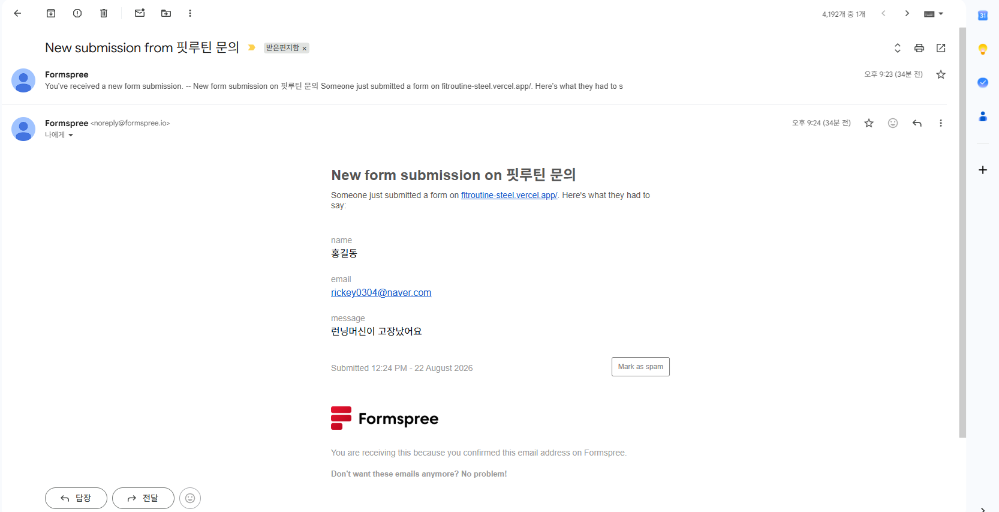

### 2. UX 및 측정 고도화
- **다크 모드**: 상단 네비게이션의 🌙 버튼으로 라이트/다크 테마를 전환할 수 있습니다. 선택한 테마는 `localStorage`에 저장되어 다음 방문 시에도 유지됩니다. (적용 화면은 위 스크린샷 섹션의 "다크 모드" 항목 참고)
- **방문자 분석**: [Vercel Web Analytics](https://vercel.com/docs/analytics)를 연동해 페이지 방문 수, 인기 페이지 등을 측정할 수 있습니다. Vercel 프로젝트 대시보드 → Analytics 탭에서 활성화하면 데이터가 쌓이기 시작합니다. (다크 모드 추가 전/후로 페이지 체류 시간이나 재방문율 변화를 비교해보는 식으로 개선 효과를 확인할 수 있습니다.)

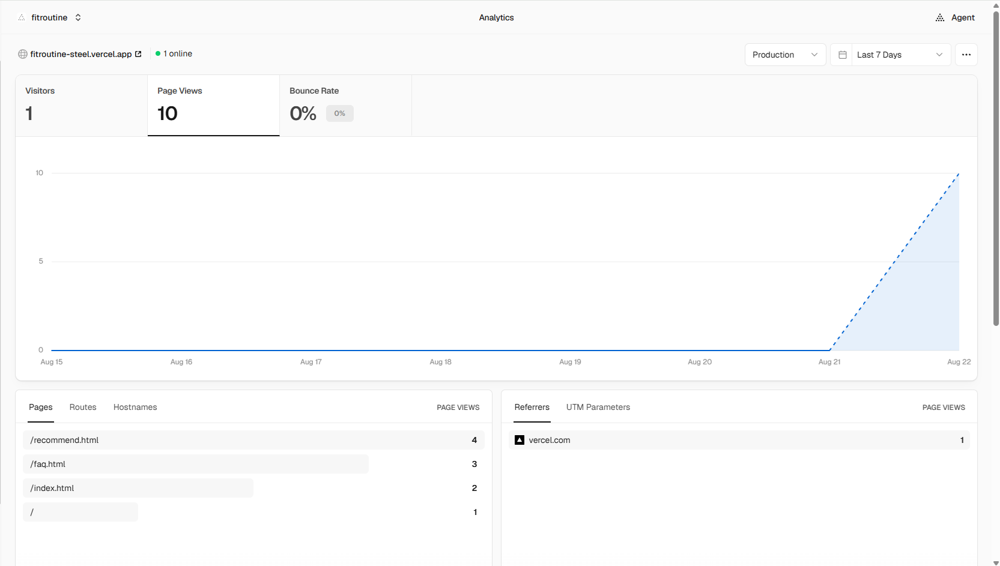

### 추가 확장 시 필요한 것들

| 확장 아이디어 | 필요한 컴포넌트 |
|---|---|
| 루틴 결과를 계정별로 저장 | 데이터베이스(예: Vercel Postgres), 사용자 인증 |
| 문의 내역을 관리자 페이지에서 조회 | Formspree 대신 DB 연동 + 관리자 전용 API 엔드포인트 |
| 루틴 추천 히스토리 보기 | `api/history.py` 같은 조회용 엔드포인트, 프론트 목록 UI |

## 스크린샷

### 데스크톱

| 메인 | AI 추천 입력 |
|---|---|
| 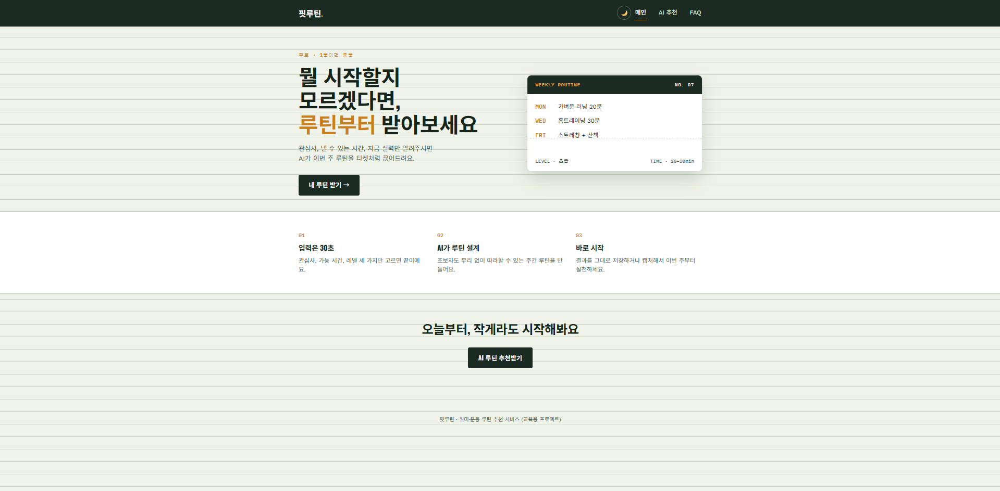 | 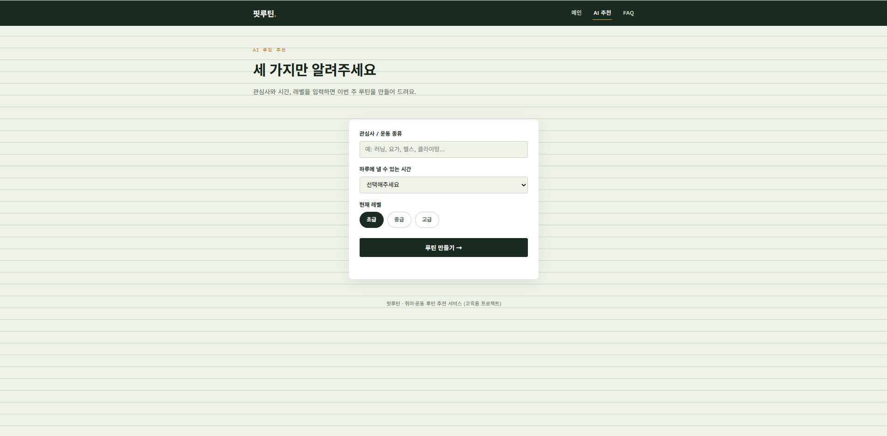 |

| AI 추천 결과 | FAQ (문의하기 포함) |
|---|---|
| 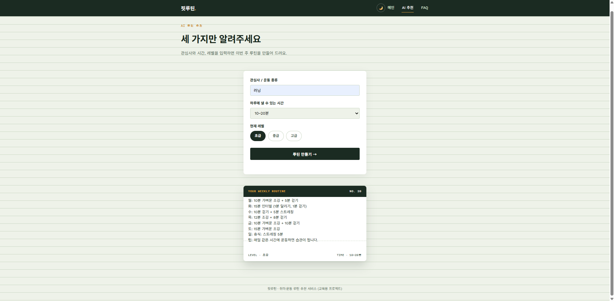 | 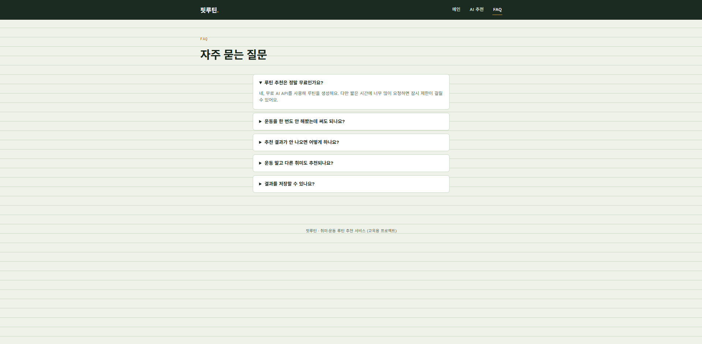 |

| 다크 모드 |
|---|
| 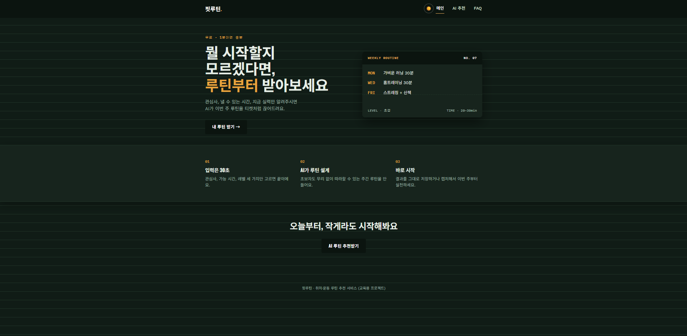 |

### 모바일

| 메인 (1) | 메인 (2) |
|---|---|
| 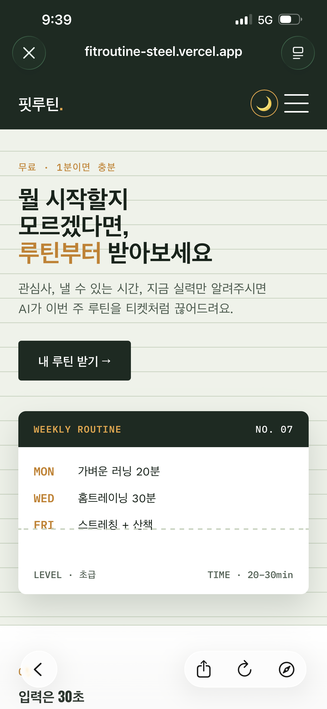 | 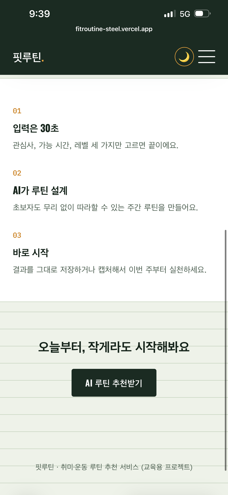 |

| AI 추천 입력 | AI 추천 결과 |
|---|---|
| 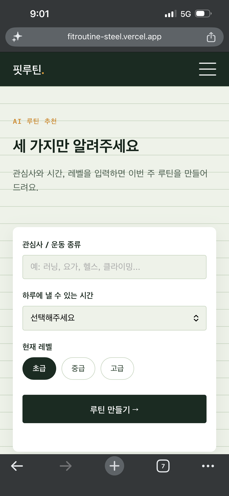 | 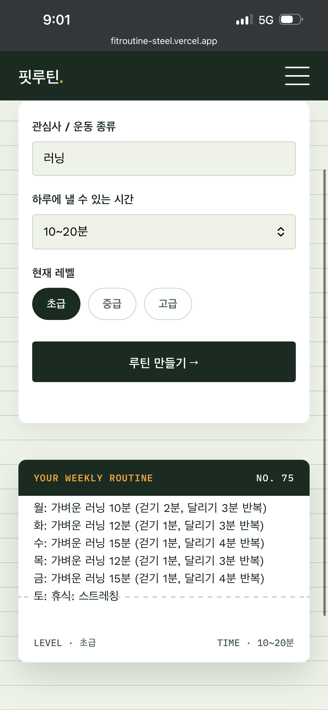 |

| FAQ (1) | FAQ - 문의하기 (2) |
|---|---|
| 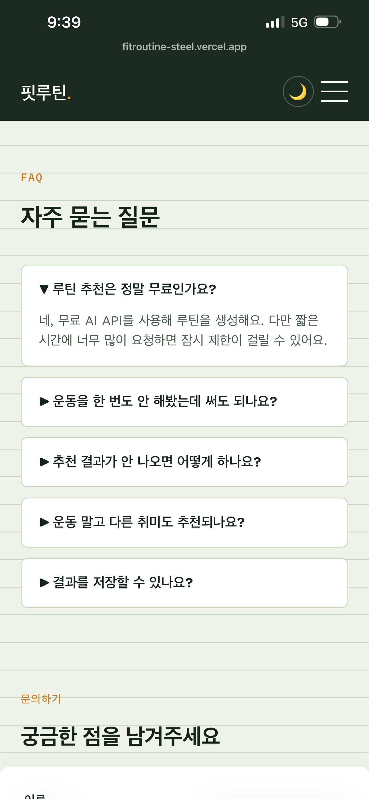 | 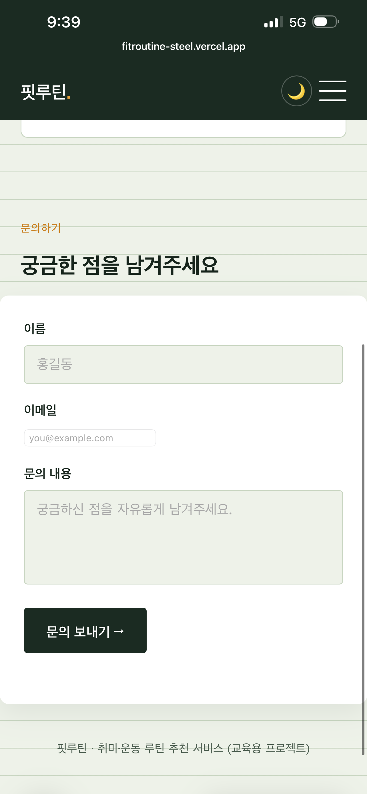 |

| 다크 모드 |
|---|
| 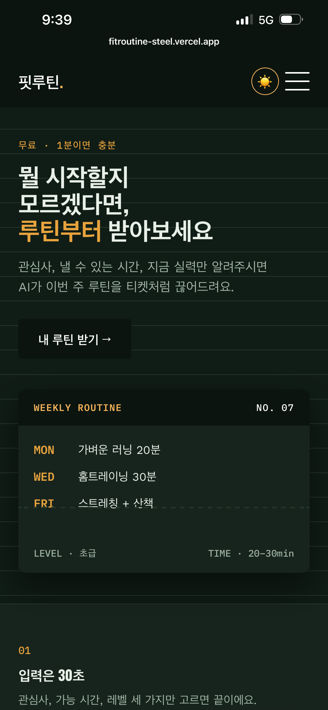 |

## AI 기능 실패 처리

| 상황 | 처리 방식 |
|---|---|
| 필수 입력값 누락 | 요청 전 프론트에서 검증, "관심사와 가능 시간을 모두 입력해주세요" 안내 |
| API 오류 (4xx/5xx) | 응답 상태 코드와 함께 오류 안내 문구 표시 |
| 응답 지연/타임아웃 | 15초 내 응답 없으면 요청 취소 후 지연 안내 문구 표시 |

### 향후 지연 개선 옵션

| 옵션 | 효과 | 트레이드오프 |
|---|---|---|
| 더 작은/빠른 모델로 변경 | 응답 속도 향상 | 루틴 품질(문장 완성도)이 다소 낮아질 수 있음 |
| 동일 입력 결과 캐싱 | 반복 요청 시 즉시 응답 | 매번 다른 루틴을 기대하는 사용자 경험과는 상충 |
| 스트리밍 응답 처리 | 체감 대기시간 감소 | 프론트/백엔드 모두 스트리밍 처리 로직 추가 필요 |

## 개발 과정에서 겪은 시행착오

배포와 디버깅 과정에서 실제로 겪은 문제와 해결 과정을 정리했습니다. AI 코딩 도구로 코드를 생성해도 오류 원인을 파악하고 직접 수정 방향을 판단하는 과정이 필요하다는 걸 배웠습니다.

| 문제 | 원인 | 해결 |
|---|---|---|
| Vercel 배포 시 "No python entrypoint found" 에러 | Vercel의 Python 프레임워크 빌드 방식이 `api/` 폴더의 진입점을 자동으로 못 찾음 | `pyproject.toml`에 `[tool.vercel] entrypoint` 설정 추가 |
| 배포 후 어떤 페이지에 접속해도 API 에러 JSON만 표시됨 | Vercel 프로젝트의 Framework Preset이 "Python"으로 설정되어, 정적 파일(HTML/CSS/JS) 없이 모든 요청이 API 함수로 감 | Framework Preset을 "Other"로 변경 (정적 파일 + `api/` 개별 함수 방식으로 전환) |
| AI 추천 요청 시 502 오류 | 사용하던 Groq 모델(`llama-3.1-8b-instant`)이 서비스 단에서 폐지(deprecated)됨 | 최신 모델(`openai/gpt-oss-20b`)로 교체 |
| Framework Preset을 바꾼 뒤에도 API 요청이 즉시 502로 실패 | `BaseHTTPRequestHandler` 클래스 기반 함수가 최신 Vercel Python 런타임과 충돌하며 요청 초반에 크래시 | Flask(WSGI) 기반으로 API 코드 재작성 |
| AI API 호출 시 403 오류 (`error code: 1010`) | Python 기본 `urllib` 요청의 User-Agent가 봇처럼 인식되어 Cloudflare가 차단 | 요청 헤더에 `User-Agent`, `Accept` 값 추가 |
| `git push` 시 GitHub가 푸시를 거부 (Push Protection) | 로컬 테스트용으로 받은 `.env.local` 파일에 실제 API 키가 포함된 채 커밋됨 | `.env.local`을 `.gitignore`에 추가하고, `git rm --cached`로 추적 해제 후 커밋을 수정(amend)해 재푸시 |
| 다크 모드 적용 후 일부 제목·버튼 글자가 안 보임 | 테마와 무관하게 항상 같은 값을 갖는 고정 색상 변수(예: 항상 흰색인 값, 항상 어두운 값)를 텍스트 색으로 사용해서, 다크 모드에서 배경과 글자가 같은 톤이 됨 | 라이트/다크 모드에 따라 자동으로 바뀌는 변수로 교체 |

## 사용한 AI 코딩 도구

- Claude (Anthropic) — 기획, 코드 생성, 디버깅 전 과정에서 활용
