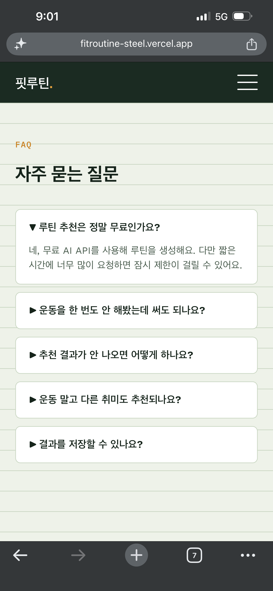

# 핏루틴 (FitRoutine)

관심사·가능 시간·현재 레벨 세 가지만 입력하면 AI가 이번 주 운동/취미 루틴을 만들어주는 웹 서비스입니다.

- 배포 URL: [https://fitroutine-steel.vercel.app](https://fitroutine-steel.vercel.app)

## 서비스 소개

운동이나 새로운 취미를 시작하고 싶지만 무엇부터 해야 할지 막막한 사람들을 위한 서비스입니다.
간단한 정보 입력만으로 AI가 초보자도 무리 없이 따라할 수 있는 7일 루틴을 "티켓" 형태로 제안합니다.

## 페이지 구성

| 페이지 | 파일 | 설명 |
|---|---|---|
| 메인 | `index.html` | 서비스 소개, AI 추천 페이지로 이동하는 CTA |
| AI 추천 | `recommend.html` | 관심사/시간/레벨 입력 → AI 루틴 결과 표시 |
| FAQ | `faq.html` | 자주 묻는 질문 |

## 기술 스택

- **프론트엔드**: HTML5, CSS3, Vanilla JavaScript (프레임워크 미사용)
- **백엔드**: Vercel Serverless Functions (Python, `http.server.BaseHTTPRequestHandler`)
- **AI API**: [Groq API](https://console.groq.com/) (`llama-3.1-8b-instant` 모델, 무료 티어)
- **배포**: Vercel

## 프로젝트 구조

```
fitroutine/
├── index.html          # 메인 페이지
├── recommend.html       # AI 추천 페이지
├── faq.html              # FAQ 페이지
├── css/
│   └── style.css         # 전체 스타일 (반응형 포함)
├── js/
│   ├── nav.js             # 모바일 메뉴 토글
│   └── recommend.js       # 폼 처리, fetch, 에러/로딩 처리
├── api/
│   └── recommend.py       # AI API 연동 서버리스 함수
├── requirements.txt       # Python 의존성 (표준 라이브러리만 사용)
├── .env.example            # 환경 변수 예시
└── README.md
```

## 로컬 실행 방법

이 프로젝트는 순수 정적 파일 + Vercel 서버리스 함수로 구성되어 있어, 로컬에서 전체 기능(AI 호출 포함)을 테스트하려면 Vercel CLI를 사용하는 것이 가장 간단합니다.

```bash
# 1. Vercel CLI 설치
npm install -g vercel

# 2. 프로젝트 폴더에서 로컬 개발 서버 실행
vercel dev
```

실행 후 안내되는 로컬 주소(예: `http://localhost:3000`)로 접속하면 프론트엔드와 `api/recommend.py`가 함께 동작합니다.

> 정적 화면만 빠르게 보고 싶다면 `index.html`을 브라우저로 바로 열어도 되지만, 이 경우 AI 추천 기능(`/api/recommend` 호출)은 동작하지 않습니다.

## 환경 변수 설정 방법

이 프로젝트는 Groq API 키를 환경 변수로 관리합니다. **코드에 키를 직접 적지 마세요.**

1. [Groq Console](https://console.groq.com/keys)에서 무료 API 키를 발급받습니다.
2. **로컬 개발 시**: 프로젝트 루트에 `.env` 파일을 만들고 아래처럼 작성합니다. (`.gitignore`에 포함되어 있어 커밋되지 않습니다.)
   ```
   GROQ_API_KEY=발급받은_키
   ```
3. **Vercel 배포 시**: Vercel 프로젝트 대시보드 → `Settings` → `Environment Variables`에서 `GROQ_API_KEY` 값을 등록합니다. 등록 후에는 재배포가 필요합니다.

## 배포 방법 (Vercel)

1. 이 저장소를 GitHub에 push 합니다.
2. [vercel.com](https://vercel.com)에서 GitHub 저장소를 Import 합니다.
3. Framework Preset은 `Other`로 두고 그대로 Deploy 합니다. (별도 빌드 설정 불필요)
4. 배포 전/후 `Settings → Environment Variables`에 `GROQ_API_KEY`를 등록합니다.
5. 배포가 끝나면 발급된 URL에서 메인/AI 추천/FAQ 페이지와 AI 기능이 정상 동작하는지 확인합니다.
6. 코드를 수정하면 `git push`만으로 자동 재배포됩니다.

## 보너스 기능

### 1. 운영 자동화 — 문의하기 폼 (Formspree 연동)
FAQ 페이지 하단에 문의하기 폼을 추가했습니다. 사용자가 이름/이메일/문의 내용을 입력하고 제출하면, [Formspree](https://formspree.io)(무료 노코드 자동화 도구)를 통해 관리자 이메일로 알림이 전송됩니다.
- 흐름: 사용자 입력 → `fetch`로 Formspree에 전송 → Formspree가 이메일로 알림 → 관리자가 확인
- **설정 방법**: [formspree.io](https://formspree.io)에서 무료 가입 후 폼을 생성하면 `https://formspree.io/f/xxxxxxx` 형태의 주소를 받습니다. 이 주소를 `js/contact.js` 파일 상단의 `FORMSPREE_ENDPOINT` 값에 붙여넣으면 바로 작동합니다.

### 2. UX 및 측정 고도화
- **다크 모드**: 상단 네비게이션의 🌙 버튼으로 라이트/다크 테마를 전환할 수 있습니다. 선택한 테마는 `localStorage`에 저장되어 다음 방문 시에도 유지됩니다.
- **방문자 분석**: [Vercel Web Analytics](https://vercel.com/docs/analytics)를 연동해 페이지 방문 수, 인기 페이지 등을 측정할 수 있습니다. Vercel 프로젝트 대시보드 → Analytics 탭에서 활성화하면 데이터가 쌓이기 시작합니다. (다크 모드 추가 전/후로 페이지 체류 시간이나 재방문율 변화를 비교해보는 식으로 개선 효과를 확인할 수 있습니다.)

## 스크린샷

### 데스크톱

| 메인 | AI 추천 입력 |
|---|---|
|  |  |

| AI 추천 결과 | FAQ |
|---|---|
|  |  |

### 모바일

| 메인 (1) | 메인 (2) |
|---|---|
|  |  |

| AI 추천 입력 | AI 추천 결과 |
|---|---|
|  |  |

| FAQ |
|---|
|  |

## AI 기능 실패 처리

| 상황 | 처리 방식 |
|---|---|
| 필수 입력값 누락 | 요청 전 프론트에서 검증, "관심사와 가능 시간을 모두 입력해주세요" 안내 |
| API 오류 (4xx/5xx) | 응답 상태 코드와 함께 오류 안내 문구 표시 |
| 응답 지연/타임아웃 | 15초 내 응답 없으면 요청 취소 후 지연 안내 문구 표시 |

## 사용한 AI 코딩 도구

- Claude (Anthropic) — 기획, 코드 생성, 디버깅 전 과정에서 활용
